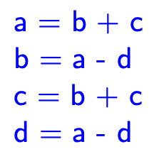

# Basic Blocks

- Identifying local common subexpressions
- Eliminating dead code
- Apply algebraic identities to simplify computations
- Reordering statements to minimise the time a temp needs to be maintained

- DAG Representation
    
    
    
    
    
    If variable b is not live on exit, we could optimise the block to
    
    a = b + c
    
    d = a - d
    
    c = d + c
    
    If the variable b and d are live on exit from this block, then we would need four instructions, but the fourth would simply be a copy
    
    a = b + c
    
    d = a - d
    
    c = d + c
    
    b = d
    
    Consider
    
    a = b + c
    
    b = b - d
    
    c = c + d
    
    e = b + c
    
    Note that a = b + c and e = b + c are not the same, as b has been redefined between the instructions
    

### Dead Code Elimination

- When is a variable live?
    
    If its value may be used in subsequent instructions
    
- When is a variable dead?
    
     if its value is not used by any subsequent instruction. Dead variables no longer require storage, freeing up registers and memory
    
- Describe a Directed Acyclical Graph
    - There is a node representing the initial value of each variable in the basic block
    - Each instruction s in the basic block has a node N associated with it. Its children are the nodes that correspond to the last definition of its operands used by s
    - Each node N is labelled by the operator at s and the list of variables and temporaries for which it is the last definition within the basic block
    - A node is an output node if its variables are live on exit i.e they will be used by another block in the control flow graph
- How do you eliminate dead code?
    
    Remove any root node that has no live variable attached to it. Repeat this until all roots have at least one live variable
    
    
    

### Algebraic Identities

- What is constant folding?
    
    Because constant expressions occur frequently, we can replace an expression like 2 * 3.14 with 6.28 at compile time
    
- Examples of computationally cheaper expressions for code optimisation
    
    x**2 = x * x
    
    2 * x = x + x
    
    x / 2 = x * 0.5
    
     
    

### Handling Array References

- Describe the correct way to handle array references in a DAG
    1. For assignments from an array, x = a[i], create a note with operator = [] with 2 children representing the initial value of the array a0 and the index i. Label the node with variable x
    2. For assignments to an array, a[i] = x, create a node with operator [] with 3 children, a0, i and x. There is no label for this node. Any existing node whose value depends on a0 is killed. A killed node cannot receive any more labels
    
- Give the DAG for x = a[i] ,a[j] = y, z = a[i]
    
    
    
- Give the DAG for b = a + 12 , x = b[i] , b[j] = y
    
    
    

### Building Basic Blocks from DAGs

- What are the rules for building a basic block from a DAG?
    1. Remove dead code
    2. We cannot generate an instruction for a node until we have generate the instructions for the node’s children
    3. If there are live variables attached to the node, store the node values in one of them and copy the value to the rest of them. If there are no variables, create a temporary
    4. Writes to an array must follow previous reads to or writes from, the same array
    5. Reads from an array element must follow any previous writes to the array
    
    - 

Create toggle for DAG question

### Code Motion

- What is code motion?
    
    Identifying loop invariant code (code that evaluates to the same value in each loop) and moving it outside the loop
    
    
    
- What is an induction variable?
    
    A variable that increases by a constant (positive or negative) during each iteration of the loop. 
    
    If there are other variables that are dependent on an induction, they may also be induction variables
    
- What is strength reduction?
    
    With induction, where a computationally expensive operation is replaced by a computationally cheaper option